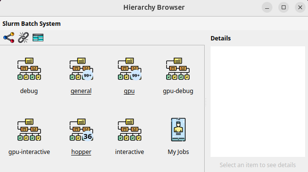

# Getting started with visualizing Slurm jobs
This document describes how you can run the Slurm provider on an HPC machine and the browser on your laptop. This setup assumes that the Slurm binaries like `sinfo` and `squeue` are available on the HPC login node.
This also assumes that you can use SSH with port forwaring to forward a local port from your laptop to the HPC login node. All communication between the provider and the browser will run securely via this SSH tunnel.

The Slurm provider requires Python version 3.7 and will throw an error if you run it with an older version. Check with `python3 --version`.

The browser uses QT5 for the graphical interface. The QT5 modules will be installed automatically in your python environment and are available for Windows, MacOS and Linux.

The example uses python virtual environments which require the `venv` package to be available in python. If you would rather use `conda` you can install the packages that are listed in the `requirements.txt` files for the provider and browser.

## Start the SLURM provider on an HPC login node
- Connect to a login node of your HPC system and forward port 9123 from the login node to your local machine
  - For example, for an HPC called "Nautilus" you can run the following command on your laptop:
  - `ssh -L 9123:localhost:9123 nautilus.university.edu`
  - The above command will both forward the port and give you a shell on the machine.
- Now install the Slurm provider on the HPC login node.
  - In the SSH session from above, clone the Github repository
  - `git clone git@github.com:RobertHenschel/HierarchyBrowserv2.git`
- Change into the directory of the SLURM provider
  - `cd HierarchyBrowserv2/providers/Slurm/`
- Create a python virtual environment and activate it
  - `python3 -m venv ./venv`
  - `source ./venv/bin/activate`
- Install required packages
  - `pip install -r ./requirements.txt`
- Run the Slurm provider
  - `./provider.py --port 9123`
  - You should see an output like this:
  - `Starting /home/users/henschel/ HierarchyBrowserv2/providers/Slurm/provider.py`
  - `Provider listening on 127.0.0.1:9123`

## Start the browser
- On your local machine, install the browser.
  - Open a terminal and clone the repository
  - `git clone git@github.com:RobertHenschel/HierarchyBrowserv2.git`
- Change ino the directory of the browser 
  - `cd HierarchyBrowserv2/browsers/PythonQT5/`
- Create a python virtual environment and activate it
  - `python3 -m venv ./venv`
  - `source ./venv/bin/activate`
- Install required packages
  - `pip install -r ./requirements.txt`
- Run the Slurm provider
  - `./browser.py --port 9123`
- The browser should start and show all partitions of the batch system.
- On the provider side, you should see an output like this:
  - `Provider listening on 127.0.0.1:9123`
  - `Incoming: {"method":"GetInfo"}`
  - `Incoming: {"method":"GetRootObjects"}`
- Here is an example of what the browser could look like on a Slurm system with 7 partitions.

